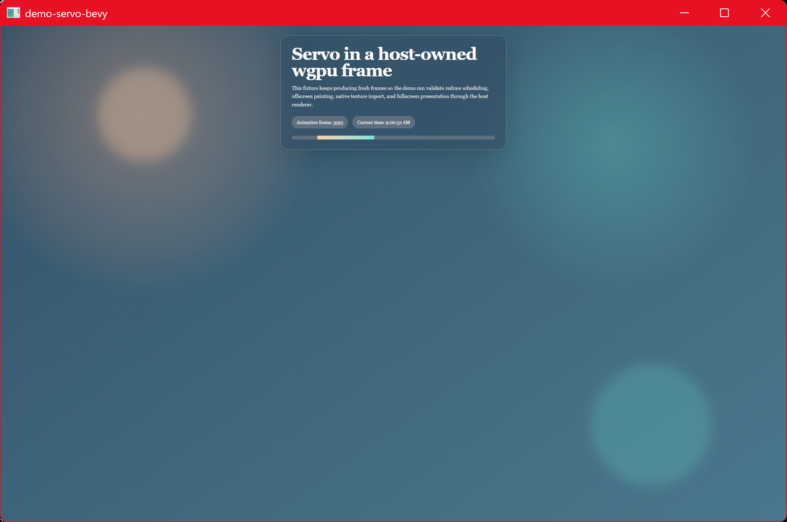

# demo-servo-bevy

Servo embedded in a [Bevy] app, zero-copy. Bevy's render world runs on its own
thread and Servo's surfman/GL context is `!Send`, so this uses the same
**shared-handle seam** as the iced demo: the producer exports a D3D12 shared NT
handle and Bevy's render world opens it on its own `RenderDevice`. No CPU
readback.



## How it works

1. **Main world:** Servo is a `NonSend` resource. A system paints it and calls
   `current_dx12_shared_texture()` to export a D3D12 shared handle into a `Send`
   `ServoFrame` resource (handle carried as a `u64`).
2. **Extract:** an `ExtractSchedule` system copies `ServoFrame` (and the
   placeholder image's `AssetId`) into the render world.
3. **Inject:** a render-world system (after `RenderSystems::PrepareAssets`,
   before `Queue`) opens the handle on Bevy's `RenderDevice` via
   `grafting::import_dx12_shared_texture`, builds a `GpuImage`, and inserts it
   into `RenderAssets<GpuImage>` for the placeholder image's id.
4. A fullscreen `Sprite` on that `Handle<Image>` (sized to the window each frame)
   is rendered by Bevy's normal 2D pipeline, sampling the Servo texture.

surfman/ANGLE is LUID-anchored to a throwaway HighPerformance-DX12 device, and
Bevy is forced to DX12 + HighPerformance (`WgpuSettings`), so the shared handle
stays single-GPU.

## Requirements (Windows)

- **DX12.** Set via Bevy's `WgpuSettings { backends: DX12, power_preference:
  HighPerformance }`. Required by the ANGLE-D3D11 → DX12 import path.
- **ANGLE DLLs.** `libEGL.dll` / `libGLESv2.dll` produced by `mozangle`'s
  `build_dlls` feature (via `demo-support`) and copied next to the binary by
  `build.rs`.

## wgpu version

Bevy 0.18 stable is on wgpu 27; **0.19.0-rc.2 is on wgpu 29**, matching the
grafting default, so the imported texture is Bevy's own `wgpu::Texture` type with
no new grafting version.

## Run

```sh
cargo run -p demo-servo-bevy                         # built-in animated fixture
cargo run -p demo-servo-bevy -- https://example.com  # load a URL
```

Input forwarding is not wired yet (display-only).

[Bevy]: https://bevyengine.org

## License

[MPL-2.0](../LICENSE)
