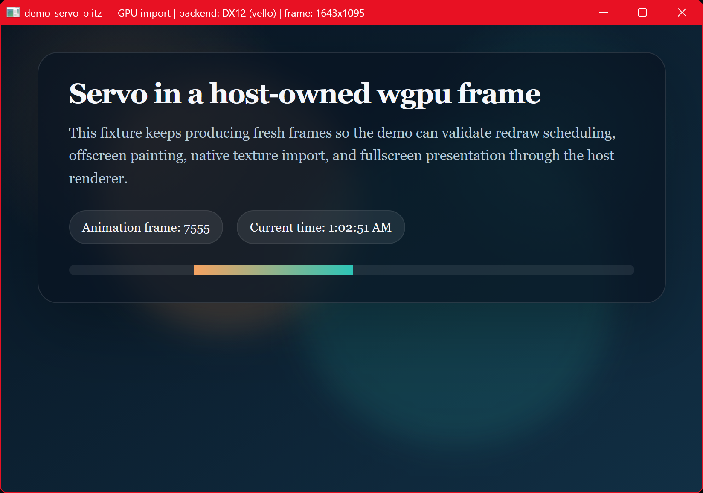

# demo-servo-blitz

Servo embedded via the **Blitz renderer stack** ([`anyrender_vello`] → [vello],
wgpu 29), zero-copy. The demo drives a `VelloWindowRenderer` — the same renderer
Blitz uses to paint its HTML/CSS UIs — takes its wgpu device, runs Servo on it,
imports each rendered frame as a `wgpu::Texture`, registers it with vello, and
fills the window with it in the vello scene. No CPU readback.



## How it works

Because we hold anyrender's wgpu device on the main thread, this uses the simple
**in-process** GL import (like the winit demo) — no shared handle needed:

1. `VelloWindowRenderer::resume()` brings up wgpu (inline on native) and
   `current_device_handle()` exposes its `Device`/`Queue`.
2. `ServoWgpuInteropAdapter::new(device, queue, size)` runs Servo on that same
   device (surfman/ANGLE LUID-matched to it).
3. Each frame: `import_current_frame_default()` imports Servo's frame into a
   top-left `Rgba8Unorm` `wgpu::Texture` (zero-copy GL → wgpu).
4. `RenderContext::try_register_custom_resource(Box::new(texture))` hands it to
   vello (`register_texture`), returning a `ResourceId`.
5. The vello scene fills the window with that resource
   (`fill(.., Paint::Resource(..), ..)`); vello copies it into its atlas on
   render. Registered per frame because the normalizer returns a fresh texture
   each frame.

The normalized texture carries `COPY_SRC` (required by vello's
`register_texture`) — that flag was added to `grafting`'s normalizer for this
path.

## Requirements (Windows)

- **DX12.** `main` sets `WGPU_BACKEND=dx12` so `anyrender_vello` (via
  `wgpu_context`'s `Backends::from_env`) uses DX12, which the ANGLE-D3D11 →
  DX12 import path and the LUID match require.
- **ANGLE DLLs.** `libEGL.dll` / `libGLESv2.dll` produced by `mozangle`'s
  `build_dlls` feature (via `demo-support`) and copied next to the binary by
  `build.rs`.

## Run

```sh
cargo run -p demo-servo-blitz                         # built-in animated fixture
cargo run -p demo-servo-blitz -- https://example.com  # load a URL
cargo run -p demo-servo-blitz -- servo.org            # auto-prefixes https://
```

[`anyrender_vello`]: https://crates.io/crates/anyrender_vello
[vello]: https://github.com/linebender/vello

## License

[MPL-2.0](../LICENSE)
