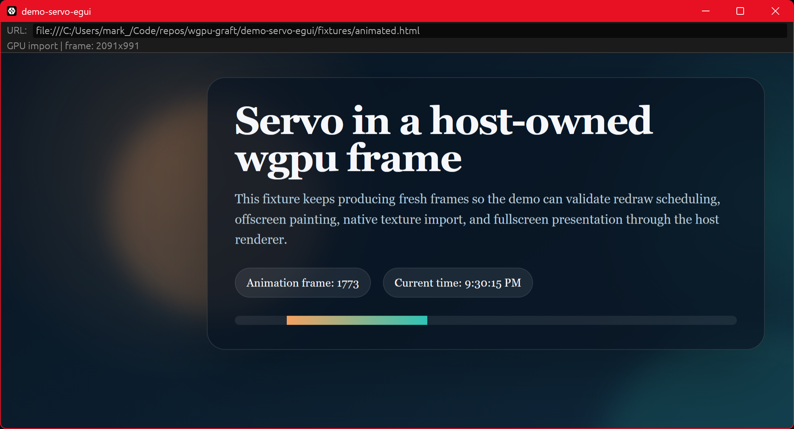

# demo-servo-egui

Servo painting into a host-owned `wgpu` frame, imported zero-copy into an
[egui]/[eframe] app. Servo renders offscreen through ANGLE (GL ES over D3D11),
and the resulting GL framebuffer is imported directly as a `wgpu::Texture` that
egui composites as a native texture. The pixels never round-trip through the CPU.



The status line reads `GPU import | frame: WxH` on the zero-copy path. The frame
size tracks the window: eframe owns the surface, so resizing fills cleanly.

## How it works

1. `servo-wgpu-interop-adapter` drives Servo into an offscreen surfman surface
   and exposes the painted GL framebuffer.
2. `grafting` imports that framebuffer into the host `wgpu` device as a texture
   (D3D11 shared handle opened on the wgpu DX12 device), normalizing it to a
   top-left-origin `Rgba8Unorm` texture.
3. The demo registers that texture with egui (`register_native_texture`) and
   paints it as a full-panel image.

## Requirements (Windows)

- **DX12 host backend.** The import LUID-matches surfman/ANGLE to the host wgpu
  adapter, which reads the adapter LUID through the DX12 backend. `main()` forces
  `wgpu::Backends::DX12` on Windows for this reason. Vulkan would fail the match
  on a multi-GPU machine (iGPU + dGPU).
- **ANGLE DLLs.** `libEGL.dll` / `libGLESv2.dll` are produced by `mozangle` with
  the `build_dlls` feature (forced via `demo-support` on Windows) and copied next
  to the binary by `build.rs`.

## Run

```sh
cargo run -p demo-servo-egui
```

### CPU readback alternative

Zero-copy is the default and the point. For comparison, a CPU-readback path is
feature-gated:

```sh
cargo run -p demo-servo-egui --features cpu-readback
```

This reads the frame back to host memory and uploads it as an egui texture each
frame. It is slower and exists only as a fallback or reference.

[egui]: https://github.com/emilk/egui
[eframe]: https://github.com/emilk/egui/tree/master/crates/eframe
