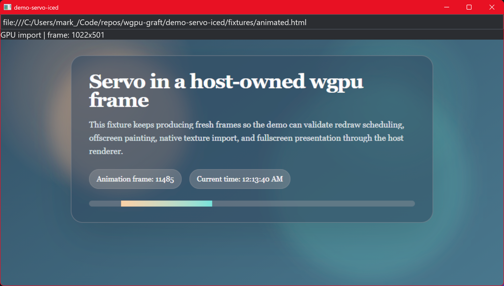

# demo-servo-iced

Servo embedded in an [iced](https://github.com/iced-rs/iced) application,
**zero-copy**: Servo's rendered frame is imported directly onto iced's own wgpu
device through a D3D12 shared handle and sampled by a custom `shader` widget. No
CPU readback. A URL bar sits above the Servo viewport with full input forwarding.



## How it works

iced owns its wgpu device and only exposes it on the render thread, inside the
`shader` widget's `Primitive` — which must be `Send`. Servo's surfman/GL context
is **not** `Send` and lives on the main thread, so it can't ride into the
primitive. The seam:

1. **Main thread (Tick):** paint Servo, then call
   `ServoWgpuRenderingContext::current_dx12_shared_texture()`. The producer blits
   the frame into a `SHARED | SHARED_NTHANDLE` D3D11 texture, `glFinish`es, and
   returns a `Dx12SharedTexture` descriptor (NT handle + size). The handle is
   carried as a plain `u64` so it crosses into the primitive `Send`-ly.
2. **Render thread (`shader::Primitive::prepare`):** `grafting::import_dx12_shared_texture`
   opens the handle on iced's wgpu DX12 device, producing a `wgpu::Texture` that
   aliases the shared resource (cached by handle + size).
3. **`Primitive::draw`:** a fullscreen-triangle pipeline samples that texture
   into the render pass iced pre-scissors to the widget bounds.

## wgpu version

iced master (0.15.0-dev) is on **wgpu 28**; the crates.io 0.14 release is on
wgpu 27. Zero-copy requires the imported texture to be iced's own
`wgpu::Texture` type, so this demo pins iced to a git rev on wgpu 28 and builds
`grafting`/the adapter with the `wgpu-28` feature (Cargo unifies them). Switch to
the crates.io 0.15 release once it ships.

## Requirements (Windows only)

The shared handle is a D3D12 resource, so this demo is Windows + DX12.

- **DX12.** `main` sets `WGPU_BACKEND=dx12` so iced picks the DX12 backend and
  the same physical GPU the handle is created on.
- **Single-GPU match.** At startup a throwaway HighPerformance-DX12 device is
  created only to read its adapter LUID and anchor surfman/ANGLE to that GPU
  (`new_for_device`). iced then creates its own device on the same GPU, so the
  shared handle stays single-GPU (cross-GPU sharing garbles → flicker).
- **ANGLE DLLs.** `libEGL.dll` / `libGLESv2.dll` are produced by `mozangle`'s
  `build_dlls` feature (via `demo-support`) and copied next to the binary by
  `build.rs`.

## Build note

Because iced here is on wgpu 28 while the winit/egui demos are on wgpu 29, the
two wgpu versions can't coexist in a single `cargo build --workspace`. Build
demos individually: `cargo run -p demo-servo-iced`.

## Usage

```sh
cargo run -p demo-servo-iced                         # built-in animated fixture
cargo run -p demo-servo-iced -- https://example.com  # load a URL
cargo run -p demo-servo-iced -- servo.org            # auto-prefixes https://
```

## License

[MPL-2.0](../LICENSE)
