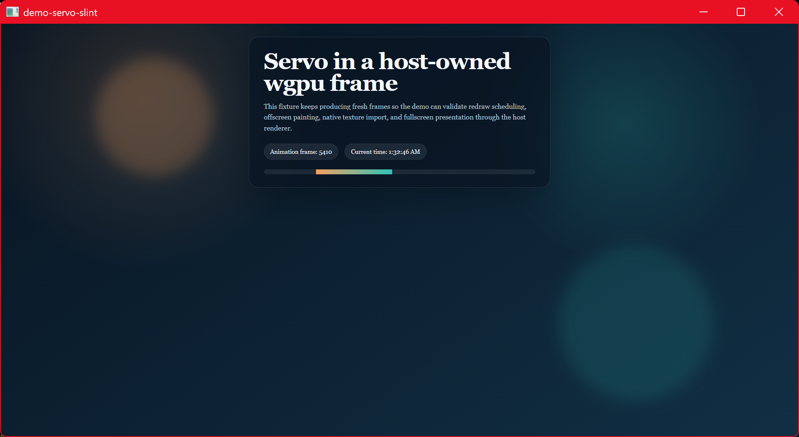

# demo-servo-slint

Servo embedded in a [Slint] UI, zero-copy, via Slint's official `unstable-wgpu`
texture interop. Slint renders through wgpu (femtovg-on-wgpu); this demo runs
Servo on Slint's own wgpu device and presents each frame with
`slint::Image::try_from(wgpu::Texture)`. No CPU readback.

This closes the loop: wgpu-graft was originally forked from Slint's
`examples/servo`. Here grafting does the import and Slint's public texture
interop does the presentation.



## How it works

1. `BackendSelector::new().require_wgpu_28(WGPUConfiguration::Automatic(..))`
   asks Slint to render through wgpu (forced to **DX12** + HighPerformance on
   Windows).
2. `Window::set_rendering_notifier` fires at `RenderingSetup` with
   `GraphicsAPI::WGPU28 { device, queue, .. }` — Slint's own device. We create
   Servo on it (`ServoWgpuInteropAdapter::new`, surfman LUID-matched to it).
3. A `slint::Timer` drives Servo each tick: `import_current_frame_default()`
   imports the frame zero-copy as a top-left `Rgba8Unorm` `wgpu::Texture`.
4. `slint::Image::try_from(texture)` wraps it as a Slint image, set on the UI's
   `frame` property; the `Image` element fills the window (`image-fit: fill`).

## wgpu version

Slint 1.16 (crates.io) is on **wgpu 28**; Slint master is on wgpu 29. Zero-copy
needs the imported texture to be Slint's own `wgpu::Texture` type, so grafting
and the adapter are built with the `wgpu-28` feature (Cargo unifies them with
Slint's wgpu). The feature flag is `unstable-wgpu-28`.

## Requirements (Windows)

- **DX12.** `WGPUSettings.backends = DX12` (set in `main`) so Slint uses DX12,
  which the ANGLE-D3D11 → DX12 import path and the LUID match require.
- **ANGLE DLLs.** `libEGL.dll` / `libGLESv2.dll` produced by `mozangle`'s
  `build_dlls` feature (via `demo-support`) and copied next to the binary by
  `build.rs`.

## Build note

Slint here is on wgpu 28 (like the iced demo) while winit/egui/Blitz are on
wgpu 29; the two can't coexist in one `cargo build --workspace`. Build demos
individually: `cargo run -p demo-servo-slint`.

## Usage

```sh
cargo run -p demo-servo-slint                         # built-in animated fixture
cargo run -p demo-servo-slint -- https://example.com  # load a URL
```

[Slint]: https://slint.dev

## License

[MPL-2.0](../LICENSE)
