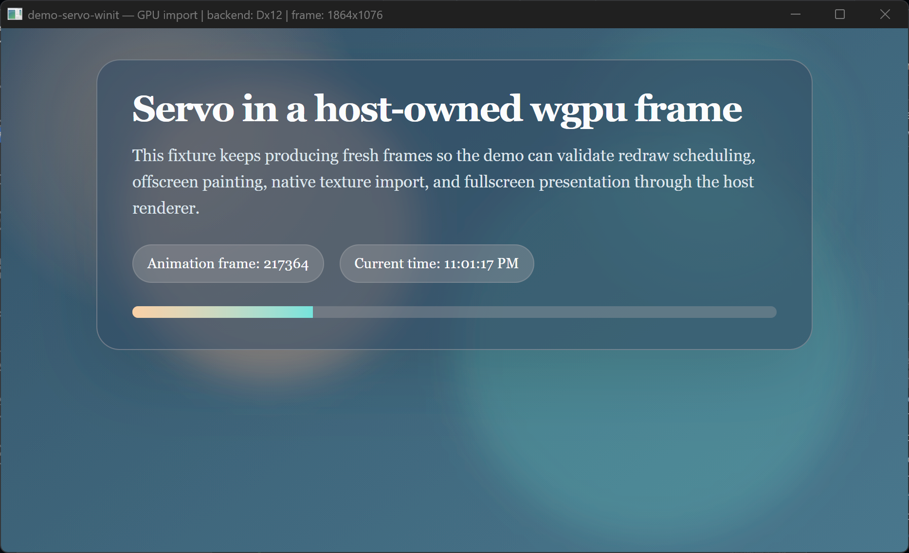

# demo-servo-winit

Minimal Servo embedding using winit + wgpu with no GUI toolkit. This is the primary reference demo for the interop layer.



## What it demonstrates

- The host owns the `wgpu::Device`, `wgpu::Queue`, and presentation surface
- Servo renders offscreen through `servo-wgpu-interop-adapter`
- GPU texture import (zero-copy) is attempted first; if the driver lacks the required GL extensions, the demo falls back to CPU readback
- Mouse, scroll, and keyboard events are forwarded to Servo for full page interactivity (clickable links, scrolling, text input)

This demo has no URL bar UI. Pass URLs via the command line; the current URL is shown in the window title. For demos with a URL bar, see the [xilem](../demo-servo-xilem/), [iced](../demo-servo-iced/), or [gpui](../demo-servo-gpui/) demos.

## Usage

```bash
cargo run -p demo-servo-winit                                  # built-in animated fixture
cargo run -p demo-servo-winit -- https://example.com           # load a URL
cargo run -p demo-servo-winit -- servo.org                     # auto-prefixes https://
cargo run -p demo-servo-winit -- demo-servo-winit/fixtures/static.html  # local file
```

## Fixtures

- `fixtures/animated.html` — continuously animating page for validating redraw scheduling and repeated frame import.
- `fixtures/static.html` — static page for checking orientation, text sharpness, and color correctness.

## Runtime diagnostics

On startup, the demo logs the URL, host backend, and capability matrix to stdout. The window title updates to show the active backend, sync mode, and imported texture size.

## Platform notes

- **Linux / macOS**: GPU import path works on compatible drivers. Falls back to CPU readback if GL extensions are missing.
- **Windows**: GPU import is attempted first. The demo uses DX12 by default for the ANGLE D3D11 → DX12 shared-texture path; set `WGPU_BACKEND=vulkan` to exercise the ANGLE D3D11 → Vulkan path. CPU readback remains the fallback if sharing is unavailable.
- **Windows multi-GPU (iGPU + dGPU)**: the import LUID-matches surfman/ANGLE to the host wgpu adapter so the shared handle stays on one GPU. This match reads the adapter LUID through the DX12 backend, so DX12 is required for zero-copy here; a cross-GPU share garbles into flicker.
- **Windows ANGLE DLLs**: `libEGL.dll` / `libGLESv2.dll` are produced by `mozangle`'s `build_dlls` feature (forced via `demo-support`) and copied next to the binary by `build.rs`.
- **Windows without nasm**: set `AWS_LC_SYS_NO_ASM=1` before building.

## Resize

Resize is driven solely by `webview.resize()`, which resizes the rendering
context, the webview rect, and the document view together. The demo must not
also call `resize_viewport()` first: that pre-sets the context size, making
Servo's `resize_rendering_context` early-return before it updates the webview
rect, which pins the page to its startup size and leaves white margins on a
larger window. The `Resized` handler also renders synchronously, because Windows
runs a modal message loop during a live resize-drag that defers `RedrawRequested`.

## License

[MPL-2.0](../LICENSE)
